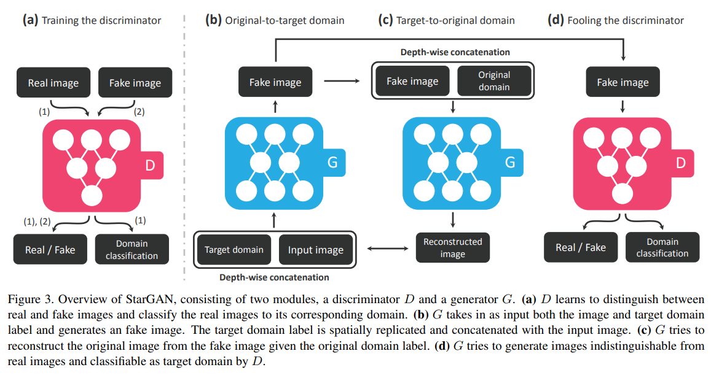
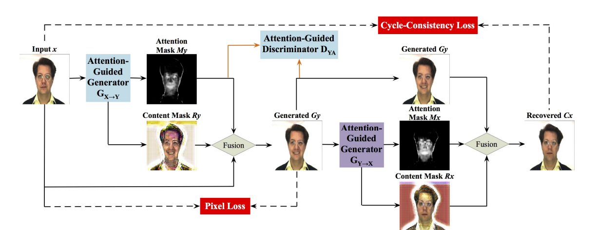
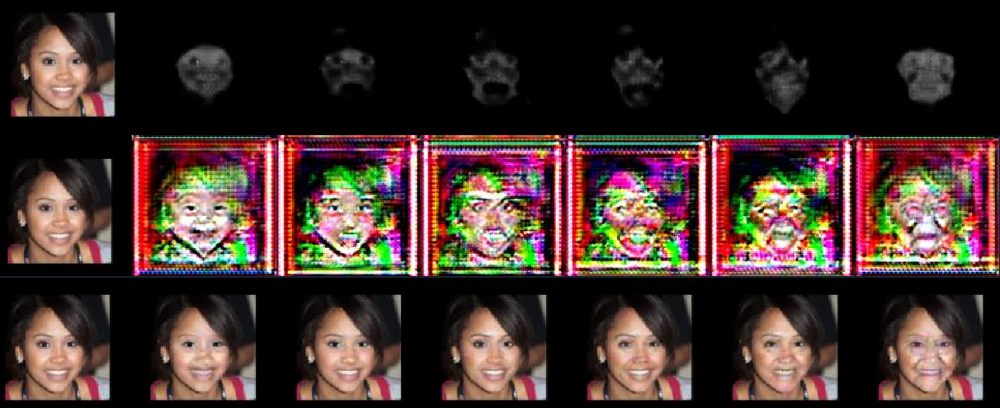

# Attention-GAN for Multi-domain Image-to-Image Translation (AttentionGAN-v1-multi)
Combination of two models:
  StarGAN: learning mappings among multiple domains using a single Generator
  AttentionGAN: convert an image from one style to another using attention mask generated from the Generator

# StarGAN
- Using single-domain translation models would take n*(n-1) different models to convert between n domains
- StarGAN is able to combine them into 1 single model
=> More efficient and lightweight

# AttentionGAN
Generated Image = Attention Mask * Content Mask  +  (1 - Attention Mask) * Input Image
=> Focus on the main features while keeping background and unimportant pixels intact

# Result:
Left to right: Age0-9, Age10-19, Age20-29, Age30-49, Age50-69, Age70+
Top to bottom row: Attention mask, Content mask, Output image

FID of Age0-9 = 133.09
FID of Age10-19 = 57.94
FID of Age20-29 = 66.09
FID of Age30-49 = 69.13
FID of Age50-69 = 77.96
FID of Age70+ = 164.54
FID of Gender = 70.64
FID of ReadingGlasses = 85.64
FID of Sunglasses = 147.57

